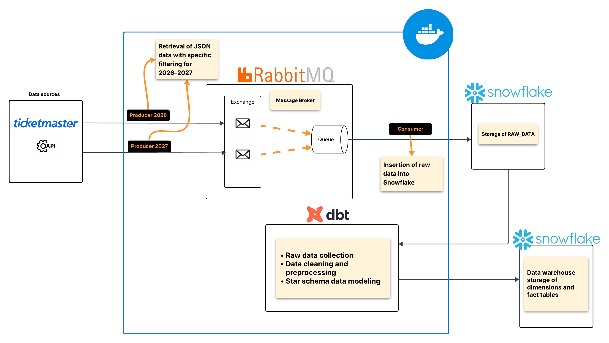

# 🎟️ Ticketmaster ELT Pipeline

## 📌 Project Overview

This project focuses on building a robust ELT (Extract, Load, Transform) data pipeline. The objective is to collect global event data via the Ticketmaster API for the years 2026 and 2027, enabling decision-making analysis and strategic planning.

The architecture relies on a message orchestrator (RabbitMQ) to ensure reliable ingestion, a Cloud Data Warehouse (Snowflake) for storage, and dbt (Data Build Tool) for transforming and modeling data into a star schema.

---

## 🏗️ Technical Architecture

The data flow follows these steps:

- **Extraction (Python Producers):**  
  Retrieve JSON data from the Ticketmaster API with filtering for the years 2026–2027.

- **Transit (RabbitMQ):**  
  Data is sent to a queue (`events_queue`) to decouple extraction from ingestion.

- **Loading (Python Consumer):**  
  Reads messages from RabbitMQ and inserts raw data into the `RAW_DATA` table in Snowflake.

- **Transformation (dbt):**  
  Cleans, types, and models the data in Snowflake to create analytical tables (Dimensions and Facts).

---

## 🛠️ Technology Stack

- **Language:** Python 3.12  
- **Message Broker:** RabbitMQ  
- **Data Warehouse:** Snowflake  
- **Transformation:** dbt (Data Build Tool)  
- **Containerization:** Docker & Docker Compose  
- **API Source:** Ticketmaster Discovery API  

---

## 📊 Data Explanation

The pipeline collects and processes **event-related data** from the Ticketmaster API. In this project, we only collect the following fields:

- **Event ID and Name**  
- **City and Venue**  
- **Event Segment** (category/segment of the event)

A known issue with this data source is the presence of **duplicate rows** and **missing values** for the event segment field.

The raw JSON data is flattened into the `EVENTS_RAW` table and later cleaned and structured into dimension and fact tables for analytical purposes.
---

## 🚀 Installation and Usage

### 1. Prerequisites

- Docker and Docker Compose installed  
- An active Snowflake account  
- A Ticketmaster API key  

---

### 2. Configuration

Create a `.env` file at the root of the project with your credentials:

TICKETMASTER_API_KEY=your_api_key  
SNOWFLAKE_USER=your_user  
SNOWFLAKE_PASS=your_password  
SNOWFLAKE_ACCOUNT=your_org-your_account  

---

### 3. Start Services

Launch RabbitMQ containers and the dbt environment:

docker compose up -d  

---

### 4. Run the Pipeline

Execute extraction and ingestion manually:

- Start the Consumer:

python3 rubbit-scripts/consumer.py  

- Start the Producers:

python3 rubbit-scripts/producer2026.py  
python3 rubbit-scripts/producer2027.py  

---

### 5. dbt Transformation

Once data is loaded into Snowflake, run the transformations:

docker compose exec dbt bash  
cd project_ticketmaster  
dbt run  

---

## 📊 Data Modeling (Star Schema)

The project uses dbt to transform raw data into a BI-optimized schema:

### 🟤 Bronze (Source)
- `EVENTS_RAW` (Flattened JSON data)

### ⚪ Silver (Cleaning)
- Date formatting  
- Handling missing values  

### 🟡 Gold (Analytics)

- `DIM_LOCATION`: Geographic details  
- `DIM_DATE`: Calendar for 2026–2027  
- `DIM_CATEGORIES`: Event categories (e.g., sports, music)  
- `FACT_EVENTS`: Central fact table linking all dimensions  

---

## 🎯 Conclusion

This project demonstrates full mastery of the data lifecycle, from asynchronous ingestion to advanced cloud-based data modeling. Docker ensures portability, while dbt guarantees data quality, consistency, and transformation traceability.
